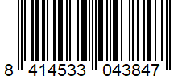

# Problema D: Inventario
## Base Name: inventario.java (inventario.cpp)

En los almacenes de acostumbra colocar a los productos un código de barras para controlar el inventario. Consiste en una técnica para representar números (y, en menos ocasiones, letras)
mediante una serie de líneas verticales paralelas, con diferentes grosores y separaciones entre ellas. Si bien el primer uso sirvió para identificar de manera automática los vagones de un ferrocarril, hoy los códigos de barras se utilizan en infinidad de lugares, siendo la catalogación de productos la más habitual.

La manera concreta de codificar mediante barras los números y las letras puede ser muy variada, lo que ha llevado a la aparición de diferentes estándares. De todos ellos, el EAN (European Article Number) resulta ser el más extendido. De éste, hay principalmente dos formatos, que se diferencian en el ancho. Existen así el llamado EAN-8, que codifica 8 números, y el EAN-13, que, naturalmente, codifica 13.

|  |  |
| :--: | :--: |
| (a) EAN-8 | (b) EAN-13 |

El último dígito del codigo se utiliza para detección de errores, y se calcula a partir de los demás. Para eso:

- Empezando por la derecha (sin contar el dígito de control que se está calculando), se suman los dígitos individuales, multiplicados por un factor:
    
    - Los dígitos en posiciones impares (empezando a contar por la derecha, saltándonos el de control) se multiplican por 3.
    - Los dígitos en posiciones pares, se multiplican por 1.

Por ejemplo, para el código EAN-8 de la figura, la operacion a realizar es:
```
2*3 + 5*1 + 9*3 + 3*1 + 8*3 + 5*1 + 6*3 = 88
```

- El dígito de comprobación es el número que hay que sumar al resultado anterior para llegar a un valor múltiplo de 10. EN el ejemplo de EAN-8, para llegar al múltiplo de de 10 más cercano por encima del numero 88 hay que sumar 2 (y llegar al 90). Ten en cuenta que, si la suma resulta ser ya múltiplo de 10, el dígito de control será 0.

En EAN-13, los primeros dígitos se usan además para identificar el país. A continuación, se indica una tabla (parcial) de esos códigos de país.

| Código | País |
| -- | -- |
| 0 | EEUU |
| 380 | Bulgaria |
| 50 | Inglaterra |
| 539 | Irlanda |
| 560 | Portugal |
| 70 | Noruega |
| 759 | Venezuela |
| 850 | Cuba |
| 890 | India |

## Entrada

La entrada estará formada por una serie de casos de prueba. Cada uno contendrá una sucesión de números pertenecientes a un código de barras EAN-8 o EAN-13, incluyendo el dígito de control. Si el número ede digitos es inferior a 8, se asumirá que es un código EAN-8; si es superior a 8 pero inferior a 13, se asumirá EAN-13. En ambos casos, se completarán el resto de dígitos colocando ceros a la izquierda.

El último caso de prueba es seguido por una línea con un 0 que no provoca salida.

## Salida

Para cada caso de prueba, el programa indicará si el dígito de control es correcto o no. Si lo es, escribirá "SI". En otro caso, escribirá "NO".

Si el código de barras es EAN-13 y correcto, el programa escribirá además el país al que pertenece utilizando la tabla anterior (separado por un espacio). Si el código no aparece en la tabla, el programa mostrará "Desconocido". Ten cuidado al escribir los países; deberás respetar el uso de mayúsculas y minúsculas de la tabla.

## Ejemplo
Entrada:
```
65839522
65839521
8414533043847
5029365779425
5129365779425
0
```

Salida:
```
SI
NO
SI Desconocido
SI Inglaterra
NO
```